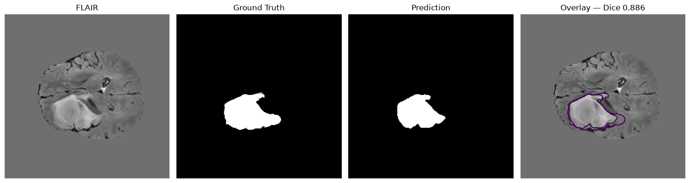
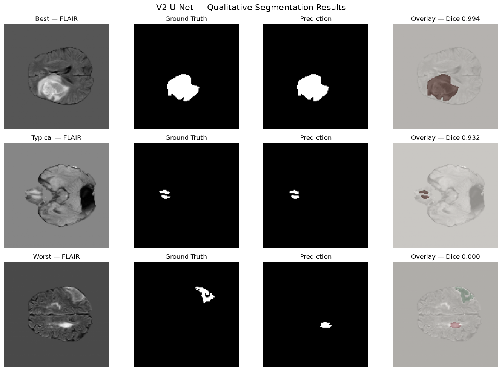

# Multimodal 3D Brain Tumor MRI Segmentation

A progressive deep-learning system for automated brain tumor segmentation from multimodal MRI volumes, developed through three model generations: **2D U-Net → 2.5D U-Net → 3D U-Net**.

The project explores how increasing spatial context affects segmentation quality while building a complete medical-imaging pipeline covering preprocessing, sampling, model training, checkpointing, volumetric inference, evaluation, and error analysis.

---

## Overview

Brain tumor segmentation requires identifying tumor regions across 3D MRI volumes while handling large volumes, class imbalance, and substantial variation between patients.

This project was developed incrementally rather than starting directly with a complex 3D architecture.

```text
V2                 V3                    V4
2D U-Net    →     2.5D U-Net      →     3D U-Net
Single slice      Multi-slice           Volumetric
context           context               context
````

Each version introduces additional spatial information and a more complete volumetric modeling strategy.

### Key capabilities

* Multimodal MRI processing
* Patient-level dataset organization
* MRI normalization and preprocessing
* Tumor-aware patch sampling
* 2D, 2.5D, and 3D segmentation architectures
* Patch-based 3D training
* Overlapping patch reconstruction
* CUDA / MPS support
* Checkpoint-based training recovery
* Patient-level evaluation
* Quantitative and qualitative error analysis

---

## Model Evolution

### V2 — 2D U-Net

The first baseline uses conventional 2D U-Net segmentation.

**Characteristics**

* Single MRI slice as input
* 2D convolutional encoder-decoder
* Slice-based preprocessing
* Patient-aware splitting
* Baseline segmentation metrics

V2 establishes a reference point for evaluating the impact of additional spatial context.

---

### V3 — 2.5D U-Net

V3 introduces additional spatial context by providing multiple neighboring slices to the network.

**Characteristics**

* Multi-slice input
* 2D convolutional processing
* Adjacent-slice spatial context
* Same general slice-level evaluation strategy as V2

V3 improves tumor-slice Dice and recall compared with V2, demonstrating the value of incorporating information from neighboring slices.

---

### V4 — 3D U-Net

V4 transitions from slice-based segmentation to full volumetric segmentation.

**Characteristics**

* 3D convolutional encoder-decoder
* Four-channel multimodal MRI input
* `64 × 128 × 128` 3D patches
* `32 × 64 × 64` patch stride
* Tumor-aware patch sampling
* Overlapping patch reconstruction
* Patient-level evaluation
* GPU-accelerated training

The V4 architecture uses a progressively expanding encoder followed by a symmetric decoder with skip connections.

          4 MRI Modalities
                 │
                 ▼
       ┌──────────────────┐
       │ 3D Patch Extract │
       │ 64 × 128 × 128   │
       └────────┬─────────┘
                │
                ▼
        ┌───────────────┐
        │    Encoder    │
        │ 32 → 64 → 128 │
        └───────┬───────┘
                │
                ▼
          ┌───────────┐
          │ Bottleneck│
          │    256    │
          └─────┬─────┘
                │
                ▼
        ┌───────────────┐
        │    Decoder    │
        │ 128 → 64 → 32 │
        └───────┬───────┘
                │
                ▼
          Tumor Mask

---

## Dataset

The project uses the **BraTS 2023 Glioma Challenge training data**.

Each patient contains multiple MRI modalities together with a tumor segmentation mask.

The repository maintains separate metadata and preprocessing pipelines for the different model generations.

Raw medical imaging data is intentionally excluded from version control.

---

# Results

## V4 Final Evaluation

V4 was evaluated on **126 held-out patients**.

| Metric         |     Result |
| -------------- | ---------: |
| **Mean Dice**  | **0.8079** |
| **Mean IoU**   | **0.7111** |
| Dice Std. Dev. |     0.1902 |
| IoU Std. Dev.  |     0.2117 |
| Best Dice      | **0.9689** |
| Worst Dice     |     0.0075 |

The patient-level Dice distribution shows substantial variation between cases, motivating the dedicated V4 error-analysis experiments.

### Best case

```text
Patient: BraTS-GLI-00768-000
Dice:    0.9689
IoU:     0.9396
```

### Worst case

```text
Patient: BraTS-GLI-00613-000
Dice:    0.0075
IoU:     0.0038
```

The worst case contained approximately **77k ground-truth tumor voxels**, while the model predicted only **437 voxels** at the default threshold. This indicates a genuine patient-level generalization failure rather than simply a small-tumor case.



---

## V2 vs V3

V2 and V3 were evaluated using the same slice-level validation framework.

| Metric             |         V2 |         V3 |
| ------------------ | ---------: | ---------: |
| Overall Pixel Dice |     0.9294 |     0.9277 |
| Mean Slice Dice    |     0.8240 | **0.8399** |
| Tumor Slice Dice   |     0.8393 | **0.8508** |
| IoU                | **0.8681** |     0.8652 |
| Precision          | **0.9380** |     0.9177 |
| Recall             |     0.9209 | **0.9380** |
| Specificity        | **0.9992** |     0.9989 |

V3 improves tumor-slice Dice and recall while slightly trading precision for increased tumor detection.

> **Note:** V4 uses a patient-level volumetric evaluation protocol, while V2/V3 use slice-level validation. Their Dice and IoU values should therefore not be interpreted as a direct leaderboard comparison.



---

# Repository Structure

```text
.
├── data/
│   └── metadata/
│
├── demo/
│   └── app.py
│
├── models/
│   ├── v2/
│   ├── v3/
│   └── v4/
│
├── notebooks/
│   ├── 01_dataset_exploration.ipynb
│   ├── 02_patient_loader.ipynb
│   ├── 03_v2_preprocessing.ipynb
│   ├── 04_v2_unet_training.ipynb
│   ├── 05_v2_unet _evaluation.ipynb
│   ├── 06_v3_preprocessing.ipynb
│   ├── 07_v3_training.ipynb
│   ├── 08_v3_evaluation.ipynb
│   ├── 09_v4_3d_unet.ipynb
│   ├── 10_v4_error_analysis.ipynb
│   └── Model_Comparison_V2_V3_V4.ipynb
│
├── results/
│   ├── figures/ 
│   ├── v2/
│   └── v4/
│
├── src/
│   ├── predict.py
│   ├── v2_2d_unet_model/
│   ├── v3_2.5d_unet_model/
│   └── v4_3d_unet_model/
│
├── main.py
├── pyproject.toml
├── requirements.txt
└── README.md
```

---

# Reproducibility

The project stores patient split metadata and uses fixed seeds where applicable.

V4 maintains a dedicated patient split:

```text
data/metadata/v4_patient_split.json
```

This prevents patient leakage between training and evaluation sets.

Model checkpoints are stored separately from the training code.

---

# Limitations

This project is an experimental research/portfolio implementation and **not a clinical diagnostic system**.

Current limitations include:

* Significant patient-to-patient performance variation
* Difficult failure cases in V4
* Different evaluation protocols across V2, V3, and V4
* No clinical validation
* No external-dataset evaluation
* Limited systematic ablation studies

The V4 benchmark should therefore be interpreted as an engineering and research result rather than a clinically validated segmentation system.

---

# Future Work

Potential V5 directions are driven by the observed V4 failure modes rather than simply increasing model size.

Planned areas include:

* Improved probability calibration
* More robust tumor-aware sampling
* Stronger 3D data augmentation
* Better handling of difficult patients
* Systematic ablation experiments
* Improved post-processing
* External-dataset evaluation
* More efficient volumetric inference

The goal of V5 is to determine **why V4 fails on difficult patients and whether targeted improvements can improve robustness without sacrificing performance on successful cases.**

---

## License

This project is intended for educational and research purposes.

## Author

**Abhra Jaiswal**

> Stay focused, stay productive, and keep leveling up! — kaizenX out. ✌️
